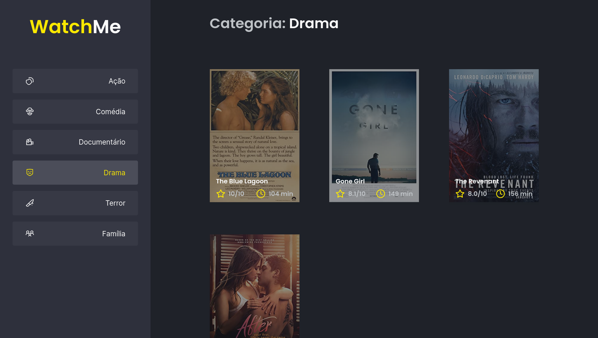

# Módulo 01 - Desafio 02

Este repositório contem a resolução do segundo desafio (opicional) da trilha de ReactJS do curso Ignite.

O template veio com tudo pronto e meus objetivos foram componentizar partes da aplicação.

As tarefas eram:
* Separar área de navegação de dentro do `App.tsx` em um arquivo `Sidebar.tsx`;
* Separar área de exibição de filmes dentro do `App.tsx` em um arquivo `Content.tsx`;
* Compartilhar nos componentes Sidebar e Content os mesmos estados, usando elevação de estado.

## Iniciando a aplicação:

Para iniciar, é necessário que os dois comandos abaixo executem paralelamente.

Com Yarn:

```
# Iniciar o servidor JSON
$ yarn server

# Iniciar aplicação
$ yarn dev
```

Com NPM:

```
# Iniciar o servidor JSON
$ npm run server

# Iniciar aplicação
$ npm run dev
```
